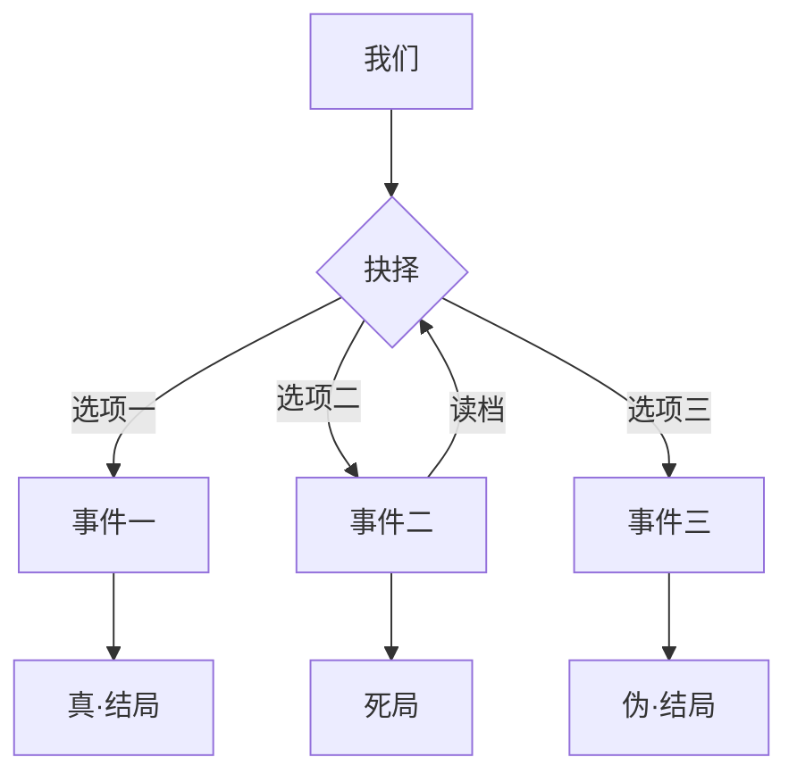

# 🎬 人生如戏

人生就像是玩文字冒险游戏，做着一个又一个的选择，最后迎来自己所决定的结局。

遗憾的是人生却不会像游戏一样可以存档读档，二次修正，从来没有完美的人生与故事。

过去所有的人与事就如同正向动力学中的骨骼解算，连续的关节依次计算出了如今的自己。

仅仅某个节点的偏差，便可能使端点大相径庭。

我也想不出有限骨骼抵达目前结局的更好解算方式，因此我很感谢在我人生轻小说剧本中出场的关键人物们与此期间的变量。

最初的犀牛鸟变量亦是其一。

人生如棋，落子无悔。

也愿诸君度过一个精彩充实而无悔的开源之夏。

::right::

