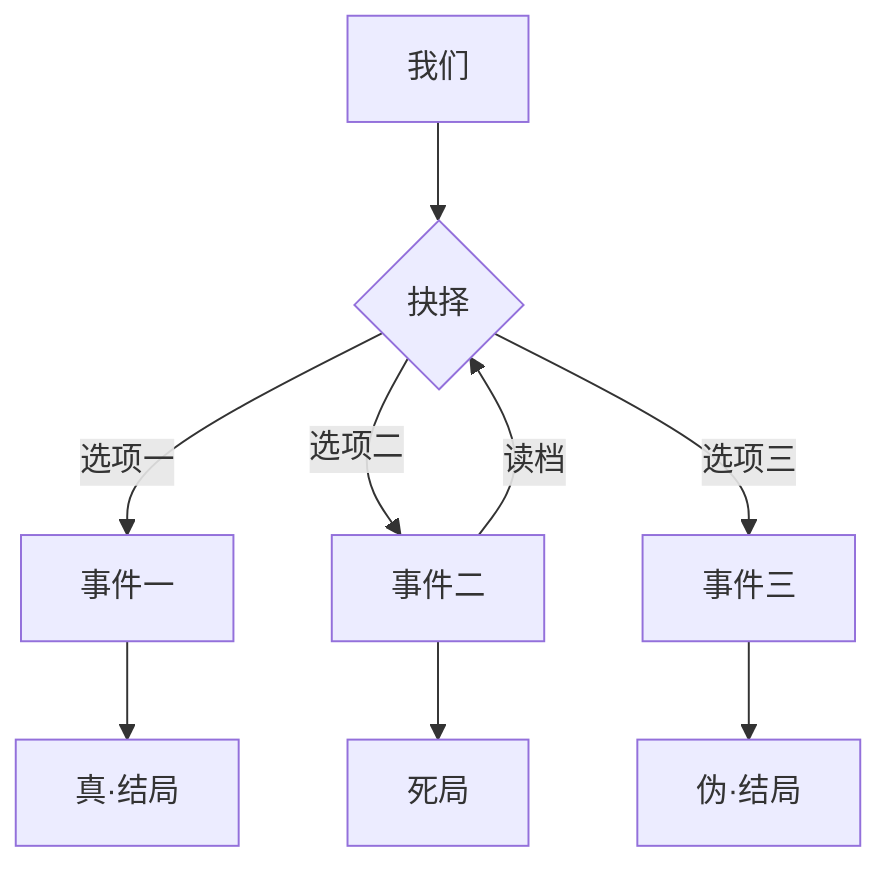
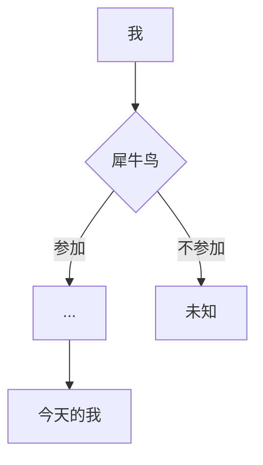
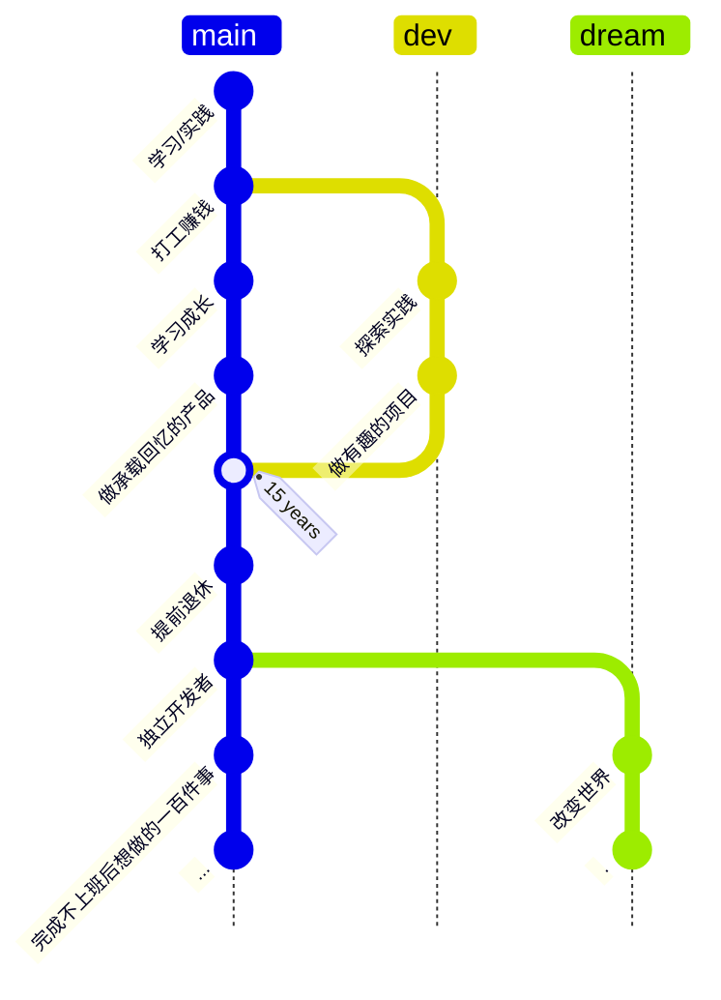

---
# You can also start simply with 'default'
theme: ./theme
layout: intro
# random image from a curated Unsplash collection by Anthony
# like them? see https://unsplash.com/collections/94734566/slidev
background: /images/bg.webp
# some information about your slides (markdown enabled)
title: 从犀牛鸟开「园」到三顾鹅厂 - 腾讯犀牛鸟发布会直播分享主题
info: |
  ## 2025 腾讯犀牛鸟开源人才计划直播分享

  云游君

  - 2021 首届犀牛鸟腾讯开源人才培养计划实战结业学生
  - 现腾讯微信前端工程师
  - Element Plus Maintainer

  [v1 版本](https://talks.yunyoujun.cn/2025-tencent-open-source-talent/v1/)

  Learn more at [YunYouJun](https://github.com/YunYouJun)
# apply unocss classes to the current slide
class: text-center
# https://sli.dev/features/drawing
drawings:
  persist: false
# slide transition: https://sli.dev/guide/animations.html#slide-transitions
transition: slide-left
# enable MDC Syntax: https://sli.dev/features/mdc
mdc: true
# open graph
# seoMeta:
#  ogImage: https://cover.sli.dev

# force color schema for the slides, can be 'auto', 'light', or 'dark'
colorSchema: light
# router mode for vue-router, can be "history" or "hash"
routerMode: hash
# controls whether texts in slides are selectable
selectable: true
src: ./pages/intro.md
---


---
layout: two-cols
layoutClass: gap-16
---

<!-- 1、三顾鹅厂用1-2页ppt写，每一顾都和犀牛鸟有关联，整体讲3-5min左右就差不多了
一顾：参与犀牛鸟；二顾：因为犀牛鸟等原因，得到了三家大厂（尤其是腾讯犀牛鸟导师）的邀请；三顾：不需要说什么原因了，就是又一次加入了鹅厂

2、围绕犀牛鸟，重点写你的【经验心得和收获】，讲10min：
（1）关于犀牛鸟，你的经验心得和收获
（2）关于腾讯，你的经验心得和收获（如在犀牛鸟感受到腾讯的项目如何等等，来到腾讯工作更全面的感受到腾讯是怎样的等等）
（3）关于开源，你的经验心得和收获

最后---保留你现在的【人生如戏】（但文字要提炼一下）+红包二维码+你的联系方式&预祝大家顺利 -->

<!-- 你的受众是今年参与犀牛鸟的学生，他们最关注的是 如何通过犀牛鸟让我像你一样入职腾讯，以及你在犀牛鸟和腾讯的收获是怎样的 -->

# 💬 分享主题

<div class="text-base op-40 italic">

「我家的后面有一个很大的园，相传叫作百草园。现在是早已并屋子一起卖给朱文公的子孙了，连那最末次的相见也已经隔了七八年，其中似乎确凿只有一些野草；**但那时却是我的乐园。**」

——鲁迅《从百草园到三味书屋》

</div>

<div class="op-70">

自我介绍，顺便和大家聊一聊

关于犀牛鸟：~~服用犀牛鸟疗程后的前后变化~~

关于腾讯：标题为什么叫三顾鹅厂

参与开源社区的经验与建议

</div>

::right::

<Toc text-4xl minDepth="1" maxDepth="1" />

<!-- 
大家好，我是云游君，很高兴能有机会以分享嘉宾的身份参与此次犀牛鸟活动。

这次主要和大家分享一下我参与犀牛鸟的活动历程和参与开源社区的经验与建议，以及加入腾讯的故事。

我摘录了鲁迅先生的《从百草园到三味书屋》开篇和标题，也作为我分享的开场白。

距离犀牛鸟的初次相见也已有三四年了，但开源也是我的乐园。

-->

---

<EVABanner />

---
layout: two-cols
layoutClass: gap-16
---

# ☁️ [自我介绍](https://intro.yunyoujun.cn)

👋 我叫「<span class="noto-serif-sc">杨睿</span>」，网名「<span class="noto-serif-sc">云游君</span>」。
<small>来自江苏连云港。</small>

目前就职于腾讯微信基础产品部，担任前端开发工程师。

非常有缘的是，我也是 2021 年[**首届**犀牛鸟开源人才培养计划实战结业学生](https://mp.weixin.qq.com/s/ktOoQZk8h_Km4dfgVMlQCA)。

<hr />

<div class="mt-4 flex gap-2 op-70">

<!-- <div class="text-center flex flex-col justify-between w-30 gap-2">

<small class="text-xs text-center">蚂蚁庄园</small>
</div> -->

<!-- <div class="text-center flex flex-col justify-between w-30 gap-2">

<small class="text-xs text-center">红包封面</small>
</div> -->

<div>

多年之后，面对犀牛鸟，云游君将会回想起，他在九平米的狭小出租屋内填写活动报名表的那个遥远午夜。

2021 年的夏天，云游君看到了一个名为犀牛鸟的开源人才培养计划。

于是，命运的齿轮开始转动。

</div>

</div>

::right::

<div>


## 开源爱好者 <div class="i-ri-github-fill inline-block -mb-1" />

一个兴趣使然的开发者


GitHub: [YunYouJun](https://github.com/YunYouJun)（云游君）


<div class="flex">


</div>

</div>

<!-- 
首先，和大家自我介绍一下。

我是云游君，目前就职于腾讯微信基础产品部，担任前端开发工程师。
读一下 PPT。非常有缘。

除了参与过犀牛鸟开源活动之外，我日常也会参与到一些别的开源项目里。
目前是 Element Plus 的维护者之一，除此之外，也会写一些自己的开源工具和产品项目。

左下角是朋友帮我打印的 3D 模型，是我学生时期最活跃的时候在 GitHub 上的提交记录。

-->

---
transition: fade-out
---

<AdvChoosePage
  title="机缘巧合，在腾讯实习的云游君看到了一个名为犀牛鸟的开源活动，但这段时间十分繁忙，是否要参加呢？"
  :choices="[
    { label: '与其不去做而后悔，不如做了之后再后悔？', do: () => $slidev.nav.next() },
    { label: '太忙了，放弃', do: () => $slidev.nav.goLast() },
  ]"
/>

<!-- 

读书的暑假期间，我在腾讯实习，那时候也在关注公司相关的开源活动，便碰巧遇见了犀牛鸟。

但是那段时间其实十分繁忙，所以我一直在犹豫是否要去参加。
万一参加后没有完成又该如何是好？

为了不让自己后悔，最终决定还是试一试，而这一次的选择也于我如同蝴蝶效应一样，影响了后续人生很多的关键节点。
乃至今天能有机会在这里和大家分享这个故事。

-->

---

<EVABanner8 />

---
layout: two-cols
layoutClass: gap-16
---

# 🐦 犀牛鸟开源

腾讯犀牛鸟开源人才培养计划

- 技术项目
  - 混元多模态模型
  - AI推理框架
  - 前端应用
  - 游戏编程
  - 大数据
  - 数据库
  - 网络
  - 编译器
  - 操作系统
- 产品项目
  - 腾讯文档

::right::

<br />
<br />
<br />

<div>

### 可以得到什么？

<br />

- 💰 丰厚的项目任务奖金
- 🏆 全球限量《腾讯开源贡献者证书》
- 🐢 结识志同道合的开源伙伴
- 🐦 参与开源社区的实战协作经验
- 🎁 各种纪念周边
- 🎓 线下研学
- 🐧 入职腾讯的面试机会？
- ...
- 🤔 补充人生的关键变量

</div>

<!-- 

参与活动可以得到什么？

我记得好像是去深圳包食宿的，可惜当时疫情种种加刚好没时间。

提前拿秋招 Offer 不一定要准备实习转正？

这些我觉得都是非常有趣的变量。

-->

---
level: 2
layout: two-cols
---

# ❓如何开始与结束

- 📄 报名！
- 🌟 选择自己感兴趣和有经验的项目
  - 没有经验怎么办？
    - 整体了解
    - 从小处着手，循序渐进
    - 阶段性进步，时间换经验
    - 不开始就永远没有经验。
- 🛠️ 完成项目任务
  - 记录完成的过程（思路），方便后续总结
  - 参与讨论/协作（可以在 GitHub 上进行，存档）
- ⛏️ 挖掘项目其他可以优化的地方
  - 主动贡献
  - 有始有终

::right::


<!-- 

首先肯定第一件事肯定就是报名。
能不能拿到奖金另说，不报就肯定没有，报了就存在可能性。

大家初期项目还不了解的话，可以去官网看看相关项目介绍和代码。
从中进一步筛选自己想要参加的项目。

其次就是要选择自己有经验并愿意花时间继续钻研的方向。
我觉得可能有些同学会想问：可我没经验怎么办？

就像旁边这张梗图一样。

但我们这个活动其实并不会上来将很多人排除在外。它是一个阶段性的活动。
你可能只要稍微有一丢丢相关的经验，编写好项目申请说明书，就可以在初期先参与进来。

项目会有一些小的任务，可以先尝试完成。
当然你如果想要通过中期和最后的考核，肯定还是要愿意深入花时间去学习和实践。

即便没有拿到最后的奖金，我们也收获了期间的经验，对于后续再有类似的活动和去找工作/实习，我们就可以说自己有一些相关的经验了。
毕竟如果不开始，就永远没有经验！

记录开发过程中的实践思路和想法、以及遇到的问题是如何解决的，方便最后总结。

最后除了项目选题布置的任务外，也可以主动挖掘项目其他可以优化的地方，主动参与贡献。
这些行为都可以直接在 GitHub 上进行，方便存档过程中的思路、进展。

当然也最好有始有终，不要半途而废。

-->


---
level: 2
---

# 🐦 犀牛鸟开源

我参与的项目是 [omi](https://github.com/tencent/omi)，导师是 [dntzhang（张磊）](https://github.com/dntzhang)，他来自微信支付团队。

[OMI](https://github.com/Tencent/OpenSourceTalent/issues/43) 是一个前端 Web Components 框架，后续也与 [TDesign](https://github.com/Tencent/OpenSourceTalent/issues/45) 进行了一些集成协作。

项目分为多个阶段：

- **项目初期**：拆分任务，以小见大
- **项目中期**：实战任务，探索优化
- **项目终期**：实践记录，总结分享

今年的形式可能有所不同，完成不同难度的 Issue 或课题，全流程参与。

不同任务完成度对应不同奖励。单人挑战/多人竞赛

- 证书/礼品
- 项目奖学金
- 实习/秋招面试机会

<!--
这里简单回忆一下我当年参与的整个流程。

- **项目初期**：导师将目标划分了多个组件任务，分配给参与的同学。
  - 大家在完成任务的同时，也可以继续对项目本身的其他内容进行优化。
- **项目中期**：视任务完成情况，导师会选择一部分学生继续参与中期的项目实战开发。
  - 我则参与了一些组件封装、部分功能开发以及 TS 工程上的优化。
- **项目终期**：同学们准备参与项目的实践总结并分享。
  - 导师则参考大家的工作决定出最终的结业名单，分配项目奖金。

在顺利进行到项目最后阶段，我除了收到一笔丰厚的奖金之外，导师也给了我一个秋招的面试机会。

-->


---

# 🐦 如何开始开源？

种树最好的时间是十年前，其次是现在，什么时候开始都不晚。

- 🧑‍🤝‍🧑 **[参与社区](https://intro.yunyoujun.cn/9)** - 学习基础的协作方式与礼仪，犀牛鸟开源活动便是一个好的开始。
- 😊 **以小见大** - 小而正确的改动，开始你的第一个 PR，积累经验。
- 📝 **循序渐进** - **持之以恒** - **尝试探索** - [**Yak Shaving**](https://antfu.me/posts/about-yak-shaving-zh)

<hr class="my-4" />

<div class="flex justify-between gap-2">

- 🐢 **慢慢来** - 开源不是严格的工作，它是一个积累的过程。秉承开源精神的同时，你可以自由地选择参与的项目和内容。**「万物皆可开源。」**
  - 🤣 [做一个无意义但有趣的项目](https://intro.yunyoujun.cn/16)
  - 🔧 [做一个服务自己的工具](https://intro.yunyoujun.cn/10)
  - 🛞 [做一个小产品](https://intro.yunyoujun.cn/17)
  - 🏃 [做一个长期项目](https://intro.yunyoujun.cn/11)

```ts
if (you.joined) {
  code.wonderful(infinity);
}
```

</div>


<style>
h1 {
  background-color: var(--ost-c-brand);
  background-image: linear-gradient(45deg, var(--ost-c-brand) 10%, var(--ost-c-brand) 20%);
  background-size: 100%;
  -webkit-background-clip: text;
  -moz-background-clip: text;
  -webkit-text-fill-color: transparent;
  -moz-text-fill-color: transparent;
}
</style>

<!--

右边的代码是我参与犀牛鸟周边礼品鼠标垫上的一段代码。

我觉得做开源写代码也会是一个无止境而有趣的旅程。

参与犀牛鸟这样的开源活动，便是一个好的开始。

而除此之外，我们也可以参与到更多的开源社区中去。
开源不像严格的工作，它是一个兴趣使然的过程。
你可以自由地选择参与的项目和内容。
不断积累经验，尝试探索更多的可能性。

这里我放了托尼老师的一篇关于 Yak Shaving 的文章。
Yak Shaving 的字面意思是为剪牦牛毛，而引申出来的意思是，当你在进行一个工作时，发现另一个工作还没有完成，你便先去解决那个工作，在进行那个工作时，你又发现另一个前置工作… 如此往复，让你偏离了原本本该完成的工作，最终却也什么都没有完成。

更贴近开发者的例子可能就是：你今天打算写篇博客，觉得现有的工具都不太行，花了一个月自己写了个静态网站生成器，最后生成器也没写完，写博客的事情却也忘了。

但另一方面，我认为这也是发掘自身需求并开源的动力。
可以是我们开始开源的契机。也是你最本质的需求。

我们可以做一些自己的小项目，取悦自己，满足自己的需求。
后续再不断扩充，做面向更多人的独立小产品或更长期的开源项目。

持之以恒下去，便会逐渐从中积累，量变到质变。

这些也是我自己参与开源的历程。

-->

---
transition: fade-out
---

<EVABanner12 title="叁顾鹅厂" author="云游君" label="第贰话" date="西历2021年-2024年" />

---

# 🐧 三顾鹅厂

<!-- - 一顾：加入腾讯实习，与犀牛鸟结缘 -->
- 一顾：参与犀牛鸟，与腾讯结缘
- 二顾：因犀牛鸟获得腾讯面试机会和秋招 Offer
- 三顾：再次加入腾讯，得以在这里和大家分享犀牛鸟的故事

关于腾讯的工作体验？工作压力？产品导向？拿来主义？

小云的摇滚下半场，想做更多有趣、有意义的产品。

<div class="flex items-start justify-center gap-4 mt-4">

<div class="flex flex-col gap-2">

<small class="text-xs text-center op-60">背井离乡成为广州帕鲁</small>
</div>

<div class="flex items-center gap-2 flex-col">

<small class="text-xs text-center op-60">腾讯一周年</small>
</div>

<div class="flex items-center gap-2 flex-col">

<small class="text-xs text-center op-60">工作日傍晚的广州塔</small>
</div>

<div class="flex items-center gap-2 flex-col">

<small class="text-xs text-center op-60">公司内部开源奖品与小云</small>
</div>

</div>

<!-- 

三顾鹅厂这里和关于腾讯直接合并一下。

标题为什么叫做三顾鹅厂呢？

第一顾：加入腾讯实习，与犀牛鸟结缘。

第二顾则是因为犀牛鸟活动从开源导师处获得了微信支付秋招的面试机会，并有幸拿到了 Offer。
但当时出于职业发展的个人规划，还是忍痛放弃了。

最后第三顾便是再次入职加入腾讯，今天得以在这里和大家分享犀牛鸟相关的故事。

我想大家也会比较好奇关于腾讯的工作体验如何？

在腾讯的这段时间，我总体上觉得还是比较开心的。
一来，腾讯的工作压力和团队氛围相较于其他大厂来说还是比较轻松的。这个我觉得大家在社交平台上都可以看到一些类似的评价。
至少我个人的体验上来说，会议时间会比前司相对少一些，可以留下更多的时间去写代码。

在日常也会有一些开源活动，这个照片上便是一些内部开源活动的小礼品。

腾讯是一个更加以产品为导向的公司，在内源的基建和工具上可能更多秉持着「拿来主义」。
我觉得「拿来主义」倒不是一个贬义词，而是要根据现况去做合理利用已有的资源，避免重复劳动。使用开源项目本质也是如此。
同时反过来我们可以利用机会参与和学习外部社区的开源项目，或是开放进一步优化的项目，反哺社区。
而不是为了开源而开源，去做一些强行推广、强制使用的内部轮子。

而我觉得技术最终也的确要为自身的目的服务，比如我自己作为开发者而不是研究型人员，
在此前的工作经历中我积累了一些特定领域的开发经验，后续我想在了解更多，积累更多后，更多地去做一些有趣有意义的产品。


-->

---
title: 🎬 人生如戏
---

# 🎬 人生如戏

人生就像是玩文字冒险游戏，做着一个又一个的选择，最后迎来自己所决定的结局。

<div grid="~ cols-3 gap-2">


<div class="flex items-center justify-center flex-col">



<div class="text-sm">
人生如棋，落子无悔。
</div>

</div>

<div class="flex items-center justify-center flex-col">




<div class="text-sm">
是否也会是你的关键变量？
</div>

</div>



</div>

<!-- 

遗憾的是人生却不会像游戏一样可以存档读档，二次修正，从来没有完美的人生与故事。

~~过去所有的人与事就如同正向动力学中的骨骼解算，连续的关节依次计算出了如今的自己。~~

过去所有节点的选择，构成了今天的自己。

仅仅某个节点的偏差，便可能使端点大相径庭。

参加犀牛鸟活动之后，在加入腾讯之前，我也面临着许多纠结并可能后悔的抉择。

~~我也想不出有限骨骼抵达目前结局的更好解算方式，因此我很感谢在我人生轻小说剧本中出场的关键变量。~~

我也想不出我自身抵达今日的更好解算方式，因此我很感谢在我人生剧本中出场的关键变量。

而犀牛鸟亦是其一。

也希望大家可以找到并利用好自己的关键变量。

也愿诸君度过一个精彩充实而无悔的开源之夏。收获满满，精彩一夏。

 -->


---
layout: thanks
title: 🙇 Thanks
---

<Thanks />

<div class="absolute bottom-3 left-0 right-0 flex items-center justify-center gap-3 flex-col">

<a href="https://wj.qq.com/s2/22592394/ahrv/" target="_blank">
报名问卷（推荐人也可以填我🤣👉🏻🤡）
</a>

<div class="text-sm text-center">
邮箱：yunyouyang@tencent.com
</div>

<a href="https://github.com/YunYouJun" target="_blank" class="text-sm text-$ost-c-brand">
<carbon:logo-github />
YunYouJun
</a>

<div>

</div>

</div>

<!--
感谢大家愿意听到这里。

这里准备了些自制的小云红包封面可以领取。

没有领到，可以填我找我要。

活动推荐人也可以填写我哦，哈哈哈。

-->

---
layout: thanks
---

<div class="text-8xl text-center font-bold top-0 bottom-0 left-12 right-12 flex flex-col  items-center justify-center absolute text-$ost-c-brand">
  THANKS
</div>

<a href="https://talks.yunyoujun.cn/2025-tencent-open-source-talent/" target="_blank" class="text-sm text-$ost-c-brand hover:underline absolute bottom-50 left-1/2 -translate-x-1/2">
  https://talks.yunyoujun.cn/2025-tencent-open-source-talent/
</a>

<BackToChoose />

<!-- 
这个是本次分享的在线链接，也可以在线查看。

在初版中我放了更多关于自己三顾腾讯的历程故事，如果有兴趣也可以找一下彩蛋。

~~被你看到了：~~

[v1 版本初稿](https://talks.yunyoujun.cn/2025-tencent-open-source-talent/v1/)
-->
